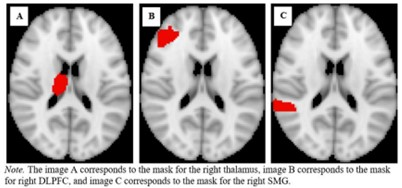
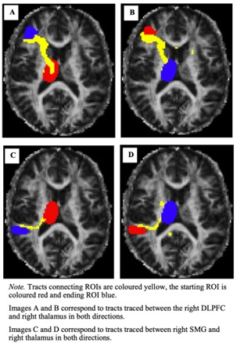

# Diffusion_Tractography_replication

This diffusion tractography pipeline replicates the methods employed by the MSc Dissertation project 'The Modulation of Intrinsic Alertness in Older Adults by Disrupted Sleep and Differences in White Matter Microstructure of Right Lateralised Thalamocortical Tracts Within the Alertness Network' (which can be found in the /Literature folder of this repository). This analysis aimed to identify the white matter thalamocortical tracts that comprise the brain's alertness network, for five of the 50 participants studied in the original report.

The Centre for Human Brain Health's (CHBH) Parallel Brain Imaging computer Cluster (PBIC), based at the University of Birmingham, was used to store the data and run the analyses for this project. This uses Linux as the OS.

## Data/directory organisation

All files/folders used in this analysis were stored in the /home/people/ota277/replication directory of the University of Birmingham's Parallel Brain Imaging computer Cluster (PBIC). This analysis replication began by navigating to the replication folder and creating a new directory:
```
pwd <br>
cd /home/people/ota277/replication <br>
mkdir part_A <br>
```
Each participant's data was stored in the respective /vasXX subdirectory of this new /part_A directory, where XX is the participant's identifying number.

The raw T1 and diffusion data for each participant was already available and was placed in a /raw_data subdirectory within each participant directory. Also provided was the pre-processed, distortion-corrected 4D diffusion data (data.nii.gz); a single non-diffusion-weighted 3D volume of the 4D diffusion data (nodif.nii.gz); a binary brain mask of the non-diffusion-weighted volume (nodif_brain_mask.nii.gz); a skull-stripped version the 3D volume (nodif_brain.nii.gz); and a fractional anisotropy map obtained from a prior fitting of a diffusion tensor (dti_FA.nii.gz). These files were placed in the /data subdirectory of each participant directory.

## BET
First, FSL's (6.0.1) Brain Extraction Tool (BET) was called from the command line, in order to remove non-brain areas from the provided T1 image for each participant (T1.nii.gz; located in the /raw_data subdirectory, within each respective participant directory). The output of this call was a skull-stripped T1 image (T1_brain.nii.gz; saved in the /data subdirectory, within each respective participant directory. This was repeated for each participant:
```
bet raw_data/T1.nii.gz data/T1_brain.nii.gz
```
Brain extraction is an important step in the pipeline of many neuroimaging analyses. In this probabilistic tractography replication, the removal of the non-brain tissue was implemented in order to more accurately estimate the white matter tracts in the later stages of the analysis, by removing sources of extraneous noise and artifacts from the image which might otherwise influence the brain signal intensities and space registration, in the subsequent tractography pipeline steps. In the context of the replication of the MSc dissertation in question, this skull-stripping step was necessary in order to enable a replication of the registration procedures carried out later in the analysis.

## Masks
The original MSc dissertation analysis specified the right thalamus (RT), the right dorsolateral prefrontal cortex (RDLPFC; cluster 6, area 9/46V) and the posterior supramarginal gyrus (PSMG) as regions of interest (ROIs), based on their evidenced functional roles in the activation of cortical regions within the alertness network of the brain. Consistent with the report's methodology, these ROIs were extracted from the Harvard Oxford Subcortical Structure Atlas, the Sallet Dorsal Frontal Parcellation Atlas, and the Harvard Oxford Cortical Structural Atlas, respectively, using the FSLeyes GUI. These ROIs were each saved as masks in the /ROI_masks subdirectory of the main /part_A directory.
Binarized versions of these masks were also generated using fslmaths in the command line:

```
fslmaths Right_Thalamus -thr 10 -bin Right_Thalamus_bin <br>
fslmaths RDLPFC -thr 20 -bin RDLPFC_bin <br>
fslmaths PSMG -thr 20 -bin PSMG_bin <br>
```

The masks were binarized in order to ensure compatability with subsequent tractography tools. These were saved in the same subdirectory (/ROI_masks). The RT, RDLPFC and PSMG masks were binarized with thresholds of 10, 20 and 20, respectively. These values were determined by visually inspecting the results of different thresholds in FSLeyes, until the closest match to those pictured in the original report were found. The use of ROIs in the original analysis would have reduced the number of comparisons involved in the tractography, reducing the risk of inflated Type I error rates that is associated with making multiple comparisons, and allowing for the establishment of more statistically meaningful effects.



## BEDPOSTX
Consistent with the original study, FSL's FDT Diffusion (5.0) BEDPOSTX tool (Bayesian Estimation of Diffusion Parameters Obtained using Sampling Techniques) was used to estimate the orientation of the white matter fibres at each voxel throughout the brain, to prepare for probabilistic tractography. BEDPOSTX utilises Markov Chain Monte Carlo sampling to estimate white matter tract orientations on the basis of neural water diffusion properties, captured by the diffusion data. This tool therefore takes the directory containing the diffusion data as an input, and outputs these white matter orientation estimates as files in a designated /data.bedpostX directory. For this replication, the /data.bedpostX directory was located in each participant directory, constituting the estimates based on each participant's data.
The original report states that the T1 and diffusion-weighted images were acquired via multi-shell diffusion MRI. This form of diffusion MRI involves the acquisition of diffusion-weighted images at multiple different sensitivities to detecting the diffusion of water molecules, which allows for a more comprehensive capture of the tissue anatomy. The researchers also specified that a maximum of three crossing fibre directions are identifiable within the data, as indicated by prior analysis. These settings were therefore similarly specified in the advanced (“Fibres” and “Multi-shell model”) options of FSL’s BEDPOSTX GUI, in order to match this procedure as closely as possible.

## Registration
The diffusion-weighted images and ROI masks were then aligned onto the same standardised space. The original report explains that the diffusion weighted images were registered to the same MNI (Montreal Neurological Institute) structural space as the ROIs. This step was therefore replicated using the FDT registration tool in the FSL GUI, to align the diffusion-weighted data with the skull-stripped main structural image (T1_brain.nii.gz), using the additional anatomical information from the un-stripped image (T1.nii.gz), to the MNI152 standard structural space (MNI152_T1_2mm_brain).  By registering the ROIs and diffusion-weighted images to the same space, their voxels were aligned and ensured that the subsequent tractography analysis corresponded to both the data and the ROIs. This was completed for each participant's data, as was done in the MSc dissertation analysis.

## PROBTRACKX

FDT Diffusion's PROBTRACKX suite was then used to run the probabilistic tractography for each participant. In order to replicate the original analysis, the tracts between the seed ROI mask (RT) and each termination ROI masks (RDLPFC and PSMG) were estimated in each direction. This equated to four individual runs in total, each comprising 5000 samples. Using the options in PROBTRACKX, the seed space was defined as structural and not diffusion space, and selected to transform the ROIs from their original structural space to diffusion space, using nonlinear warp fields. Specifically, this was done by inputting the /standard2diff_warp.nii.gz file (located in the /data.bedpostX directory) as the "seed to diff transform", and the /diff2standard_warp.nii.gz file (located in the /data.bedpostX directory) as the "diff to seed transform". This enabled accurate mapping of the white matter tracts between seed and termination ROIs. The given termination mask of each run was also input as the waypoint mask, in order to prevent random offshoots and other noisy tracts from being generated that would otherwise occur without a specified direction. In accordance with the original analysis, the curvature threshold was set to 0.2, meaning that streamlines were terminated not only if they reached the termination ROI but also if they exceeded this extent of curvature.

The directory to contain the output files of the replicated tractography analysis was set as the /Tractography_analysis subdirectory, within each participant directory (/home/people/ota277/replication/part_A/vasXX/Tractography_analysis). Within this output subdirectory, the tractography analyses were organised into further subdirectories (/RT-RDLPFC, /RDLPFC-RT, /RT-PSMG, /PSMG-RT), according to the seed and termination ROIs that they were run between.

## Results

This replication successfully produced similar results to those produced from the MSc dissertation (pictured below), identifying the white matter tracts between the right thalamus and right DLPFC (in both directions) and between the right thalamus and posterior supramarginal gyrus (in both directions).




